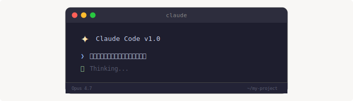

# 1. Claude Code のインストールと基本操作



最初に「CLIベースのAIツール」と聞いたとき、正直戸惑いました。GUIの方が楽じゃない？と。でも使い始めて1週間で考えが完全に変わりました。ターミナルから離れずにAIと協業できるこの体験は、一度味わうと戻れません。

### たとえ話：隣の席の熟練同僚

Claude Code は検索エンジンではありません。**ターミナルの隣に座っている、熟練した同僚**のようなものです。

検索エンジンは「聞いたら答えを返してくれる図書館」。でも Claude Code は違う。あなたのプロジェクトのファイルを見て、コードを読んで、「ここ、こうした方がよくない？」と提案してくる。一緒にペアプロしてくれる存在です。

しかも、この同僚は休まない。疲れない。「前に言ったじゃん」とキレない。朝4時に呼び出しても嫌な顔一つしない（人間の同僚にはできない）。

あなたもこう思ったことありませんか？——「この問題、誰かに壁打ちしたいけど、チームメンバーは今忙しい」。Claude Code はまさにその穴を埋めてくれる存在です。

Claude Code は Anthropic が提供する公式のAIコーディングアシスタントCLIです。ターミナルから直接 Claude と対話しながら、コードの生成・編集・デバッグ・リファクタリングなどを行えます。

## インストール

```bash
# npm でインストール
npm install -g @anthropic-ai/claude-code

# インストール確認
claude --version
```

初回起動時に Anthropic アカウントでの認証が求められます。

```bash
# 起動
claude
```

## 基本的な使い方

### 対話モード

```bash
# プロジェクトディレクトリで起動
cd your-project
claude
```

起動するとチャット形式で Claude と対話できます。プロジェクト内のファイルを読み書きしたり、ターミナルコマンドを実行したりできます。

### なぜ CLI なのか？ — 開発者たちの判断

Anthropic のエンジニアチームがなぜ GUI ではなく CLI を選んだのか。それには明確な理由があります。

開発者の多くは、一日の大半をターミナルで過ごしています。git、docker、npm、ssh——これらすべてが CLI です。そこに AI を「もう一つのCLIツール」として統合すれば、ウィンドウを切り替える必要がない。思考の流れを切らない。

VSCode の Copilot や Cursor のように GUI に統合する方法もありますが、Claude Code はあえて「エディタに依存しない」道を選びました。Vim でも Emacs でも IntelliJ でも、あなたが何を使っていても関係ない。ターミナルさえあればいい。

この設計思想は Unix 哲学——「一つのことをうまくやる」「組み合わせて使う」——そのものです。

### よく使う操作

| 操作 | 例 |
|------|-----|
| コード生成 | 「このAPIにバリデーションを追加して」 |
| バグ修正 | 「このエラーの原因を調べて修正して」 |
| リファクタリング | 「この関数をテスト可能な形にリファクタして」 |
| テスト作成 | 「このモジュールのユニットテストを書いて」 |
| コード説明 | 「この処理の流れを説明して」 |

### スラッシュコマンド

チャット中に使えるコマンド：

| コマンド | 説明 |
|---------|------|
| `/help` | ヘルプを表示 |
| `/clear` | 会話履歴をクリア |
| `/compact` | 会話を要約してコンテキストを節約 |
| `! command` | シェルコマンドを実行（結果が会話に入る） |

## CLAUDE.md によるプロジェクト設定

プロジェクトルートに `CLAUDE.md` を置くと、Claude Code がプロジェクトのコンテキストを自動的に読み込みます。

```markdown
# CLAUDE.md の例

## プロジェクト概要
このプロジェクトは Next.js + TypeScript で構築された SaaS アプリケーションです。

## 技術スタック
- Next.js 15 (App Router)
- TypeScript
- Prisma + PostgreSQL
- Tailwind CSS

## コーディング規約
- 関数コンポーネントを使用する
- エラーハンドリングは Result 型パターンを使う
- テストは vitest で書く
```

**ポイント：** CLAUDE.md に書いた情報は毎回の会話に自動で読み込まれるため、繰り返し説明する必要がなくなります。

## パーミッションモード

Claude Code はファイル編集やコマンド実行の前に確認を求めます。信頼度に応じてモードを切り替えられます：

| モード | 動作 |
|--------|------|
| **default** | 各操作で確認を求める |
| **auto** | 読み取り操作は自動許可、書き込みは確認 |
| **bypassPermissions** | すべて自動許可（上級者向け） |

## 利用制限について

Claude Code には**5時間ごとの利用制限**と**週間制限**があります。これは理解しておくべき重要なポイントです。

あなたもこう思ったことありませんか？——「ノッてきたのに制限に引っかかった...」。私は何度もあります。だからこそ、制限の仕組みを理解して上手く付き合うことが大事です。

### 5時間制限

各プランで5時間あたりに使えるトークン量（＝会話の量）に上限があります。上限に達すると、次の5時間枠が開くまで待つか、制限が緩和されるのを待つ必要があります。

### 週間制限

5時間制限とは別に、週単位でも利用上限があります。週の後半になると制限に引っかかりやすくなります。

### 実際の影響

| プラン | 体感 |
|--------|------|
| **Pro（$20）** | 軽い作業なら数回で制限に。本格利用は厳しい |
| **Max（$100）** | 1日中使っても概ね大丈夫。重い作業を連続すると制限に当たることも |
| **Max 20x（$200）** | ほぼ制限を気にせず使える |

### 制限への対策

- **`/compact` を活用** — 会話を圧縮してトークン消費を抑える
- **`/clear` でこまめにリセット** — 不要なコンテキストを捨てる
- **軽いタスクはローカルLLMに逃がす** — LM Studio 等で代替
- **計画的に使う** — 重要な作業を先にやり、調べものは後回しにする

制限に達しても作業内容は保存されるので、`claude --continue` で後から再開できます。

---

## Q&A — よくある疑問

### Q: CLIは怖い？ GUIに慣れている自分でも大丈夫？

**A:** 大丈夫です。Claude Code で使うCLIの知識は最小限です。`cd` でディレクトリを移動して `claude` と打つだけ。あとは自然言語で話しかけるだけなので、実質的にはチャットと同じ体験です。「ターミナル」という見た目に惑わされないでください——中身はただの会話です。

### Q: 既存のIDE（VSCode, IntelliJ等）と併用できる？

**A:** もちろんできます。むしろそれが推奨される使い方です。ターミナルを IDE 内で開いて Claude Code を起動すれば、コードエディタを見ながら AI と対話できます。Claude Code がファイルを編集すると、IDE 側にリアルタイムで反映されます。Cursor や Copilot と競合することもありません。

### Q: 制限に当たったらどうする？ 作業途中のものは消える？

**A:** 消えません。制限に達してもセッションは保存されます。`claude --continue` で再開できるので、時間を置いてから続きを始めればOKです。急ぎの場合は、ローカル LLM（LM Studio + Qwen 等）で軽い調査だけ進めておいて、制限が解除されたら Claude Code に戻る、という運用がおすすめです。

---

[← 目次に戻る](./) | [次: AI エージェントパターン →](02-agent-patterns)
