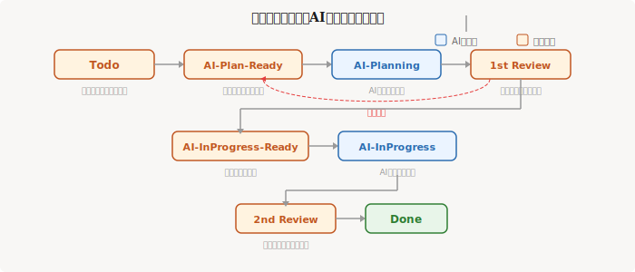

# 3. MCP サーバーの活用


AIがどれだけ賢くても、社内のJIRAチケットやSlackの会話の中身は知りません。「あのIssueどうなった？」と聞いても答えられない。その壁を壊すのがMCPです。AIと社内システムをつなぐ「配線」だと思ってください。

## MCP（Model Context Protocol）とは

MCP は Anthropic が策定したオープンプロトコルで、LLM に外部ツールやデータソースへのアクセスを提供します。「LLM版のUSBポート」のようなもので、様々なサービスをプラグインとして接続できます。

```
Claude Code / Claude Desktop
    ↕ MCP プロトコル
┌─────────┐ ┌─────────┐ ┌─────────┐
│  JIRA   │ │ GitHub  │ │  Slack  │
│ Server  │ │ Server  │ │ Server  │
└─────────┘ └─────────┘ └─────────┘
```

## 設定方法

### Claude Code の場合

プロジェクトルートに `.mcp.json` を作成するか、`claude mcp add` コマンドで追加します。

```bash
# MCP サーバーを追加
claude mcp add server-name -- npx @some/mcp-server

# 設定ファイルで管理する場合
cat .mcp.json
```

```json
{
  "mcpServers": {
    "github": {
      "command": "npx",
      "args": ["-y", "@modelcontextprotocol/server-github"],
      "env": {
        "GITHUB_PERSONAL_ACCESS_TOKEN": "ghp_xxxxx"
      }
    }
  }
}
```

### Claude Desktop の場合

設定画面 → Developer → MCP Servers から追加できます。設定ファイルは以下にあります：

- macOS: `~/Library/Application Support/Claude/claude_desktop_config.json`
- Windows: `%APPDATA%\Claude\claude_desktop_config.json`

## タスク管理への応用

### JIRA 連携

MCP サーバー���通じて、Claude から直接 JIRA のチケットを操作できます。

**できること：**
- チケットの作成・更新・検索
- ステータス変更
- コメント追加
- スプリント情報の取得

### GitHub Issues 連携

GitHub の MCP サーバーを使えば、Issue の管理も Claude から直接行えます。

**できること：**
- Issue の作成・編集・クローズ
- ラベルの付与
- PR の作成・レビュー確認
- リポジトリの検索

## ステータス駆動のAI協業ワークフロー



JIRA や GitHub Issues の真価は、単にチケットを作ることではありません。**ステータスをこまめに管理し、AIと人間の役割分担を明確にする**ことで、タスクを効率的かつ安全に進められます。

### 推奨ステータスフロー

```
Todo
 │  タスク登録。概要と詰めるべき論点を箇条書き
 ▼
AI-Plan-Ready
 │  人が「AIに計画させてOK」と判断したタスク
 ▼
AI-Planning
 │  AIが詳細な実行計画・設計を作成中
 ▼
1st Review ◀─────────────────┐
 │  人がAIの計画をレビュー     │
 │  問題があれば差し戻し ──────┘
 ▼
AI-InProgress-Ready
 │  計画承認済み。AIに実行させてOK
 ▼
AI-InProgress
 │  AIが実装・タスク実行中
 ▼
2nd Review
 │  人が成果物をレビュー
 ▼
Done
```

### 各ステータスの詳細

| ステータス | 誰が動くか | やること |
|-----------|-----------|---------|
| **Todo** | 人 | タスクを登録。概要を書き、詰めるべきポイントを箇条書きにする |
| **AI-Plan-Ready** | 人 → AI | 人が「AIに計画させてよい」と判断したらこのステータスに変更 |
| **AI-Planning** | AI | AIが要件を分析し、詳細な計画・設計・手順を作成する |
| **1st Review** | 人 | AIが作った計画をレビュー。問題があれば AI-Plan-Ready に差し戻す |
| **AI-InProgress-Ready** | 人 → AI | 計画が承認されたらこのステータスに。AIが着手してよい合図 |
| **AI-InProgress** | AI | AIが計画に沿って実装・タスクを実行する |
| **2nd Review** | 人 | AIの成果物をレビュー。修正が必要なら差し戻す |
| **Done** | 人 | レビュー通過。完了 |

### なぜステータスを細かく分けるのか

**「AIに丸投げして終わり」ではなく、「人がチェックポイントで判断する」** のがポイントです。

- **計画と実行を分離する** — AIにいきなりコードを書かせると方向を間違えることがある。まず計画させ、人がレビューしてから実行に移す
- **差し戻しを恐れない** — 1st Review で計画に問題があれば AI-Plan-Ready に戻す。手戻りは早いほどコストが低い
- **ステータスが記録になる** — 誰が（人/AI）いつ何をしたかがチケットの履歴に残る

### loop ツールによる自動ステータス監視

Claude Code の `/loop` コマンドを使うと、ステータスを定期的に監視し、AIが自動的にタスクを拾って進めることができます。

```
# 5分ごとにAI-Plan-ReadyのIssueを監視して計画を作成
/loop 5m AI-Plan-Ready のIssueを確認して、あれば計画を作成してAI-Planningに変更

# AI-InProgress-ReadyのIssueを監視して自動実行
/loop 5m AI-InProgress-Ready のIssueを確認して、あれば実行してAI-InProgressに変更
```

これにより、**人はステータスを変えるだけで、AIが自律的にタスクを進行**します。

```
┌──────────────────────────────────────────────────┐
│  人間の作業                                        │
│  ・Todoにタスク登録                                │
│  ・AI-Plan-Readyに変更（AIに計画させるトリガー）    │
│  ・1st Review でAIの計画をチェック                  │
│  ・AI-InProgress-Readyに変更（実行のトリガー）      │
│  ・2nd Review で成果物をチェック                    │
│  ・Done に変更                                    │
└───────────┬───────────────��──────────┬───────────┘
            │                          │
            ▼                          ▼
┌───────────────────┐    ┌───────────────────┐
│  AIセッションA     │    │  AIセッションB     │
│  /loop 5m          │    │  /loop 5m          │
│  AI-Plan-Ready     │    │  AI-InProgress     │
��  を監視 → 計画作成  │    │  -Ready を監視     │
│                    │    │  → 実装実行         │
└───────────────────┘    └───────────────────┘
```

**複数のタスクを並列で進める**ことも可能です。AIセッションを複数立ち上げ、それぞれが異なるステータスを監視することで、計画と実行を同時進行できます。

### 実際の運用例

```
> 「ユーザー認証のリファクタリング」をTodoとしてIssueに登録して。
> 詰めるべき点：既存セッション管理との互換性、OAuth対応の要否、テスト方針

（人がIssueを確認し、AI-Plan-Ready に変更）

> AI-Plan-Ready のIssueを確認して。計画を作成してIssueにコメントして。

（AIが計画を作成 → 1st Review に変更）
（人が計画をレビュー → OKなら AI-InProgress-Ready に変更）

> AI-InProgress-Ready のIssueを確認して。計画に沿って実装して。

（AIが実装 → 2nd Review に変更）
（人が成果物をレビュー → Done）
```

## セッション間の記憶を保持する — Recall

Claude の会話はセッションごとにリセットされます。「前回決めたこと」「このプロジェクトのルール」を毎回説明し直すのは手間です。

[Recall](https://github.com/joseairosa/recall) は Claude に**永続的な記憶**を与える MCP サーバーです。会話を超えて、決定事項・コードパターン・プロジェクト知識を保存し、必要なときに自動で取得してくれます。

**主な機能：**
- セッションをまたいだ記憶の保存・検索
- セマンティック検索で関連情報を自動抽出
- プロジェクト（ワークスペース）ごとに記憶を分離
- 類似した記憶の自動統合

**セットアップ：**

```bash
# Cloud版（推奨・すぐ始められる）
# recallmcp.com でアカウント作成 → APIキー取得

# Claude Code に追加
claude mcp add recall -- npx @joseairosa/recall --api-key YOUR_KEY
```

| プラン | 料金 | 記憶数 |
|--------|------|--------|
| Free | 無料 | 500件 |
| Pro | $4.99/月 | 5,000件 |
| Self-hosted | 無料 | 無制限 |

Self-hosted 版は Redis/Valkey をローカルで動かすことで、完全にデータを自分で管理できます。

**使い方の例：**
```
> このプロジェクトではAPIのレスポンスは必ずsnake_caseにするルールを覚えて
> 前回のセッションで決めたDB設計の方針を思い出して
```

## その他の便利な MCP サーバー

| MCP サーバー | 用途 |
|-------------|------|
| **Slack** | チャンネル閲覧・メッセージ送信 |
| **Google Calendar** | 予定の確認・作成 |
| **Filesystem** | ローカルファイルの読み書き |
| **PostgreSQL** | データベースへの直接クエリ |
| **Brave Search** | Web検索 |
| **Recall** | セッション間の記憶保持 |

## MCP サー���ーの探し方

- [MCP Server Registry](https://github.com/modelcontextprotocol/servers) — 公式リポジトリ
- npm で `@modelcontextprotocol/` や `mcp-server-` で検索

---

[← 目次に戻る](./) | [前: AI エージェントパターン](02-agent-patterns) | [次: オーケストレーションツール →](04-custom-orchestration)
