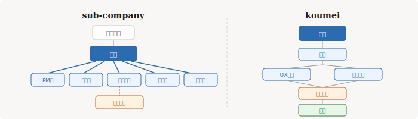

# 4. 手製 AI オーケストレーションツール



Claude Code のスキル（プラグイン）として開発した、2つのAIオーケストレーションツールを紹介します。

Anthropic 公式のエージェントパターン（[前章参照](02-agent-patterns)）を実務に落とし込んだ実装例です。

---

## sub-company（子会社型オーケストレーション）

### コンセプト

「AIに会社組織を持たせる」というアプローチ。秘書が窓口となり、専門部署にサブエージェントとして仕事を並列で振ります。

Anthropic パターンでいうと **オーケストレーター・ワーカー** + **エバリュエーター・オプティマイザー** の組み合わせです。

### 組織構成

```
ユーザー
  ↓ 依頼
秘書（さくら）── 指揮・調整
  ↓ 命令書
┌──────┬──────┬──────┬──────┬──────┐
│ PM部 │開発部│マーケ部│営業部│経営企画│
└──────┴──────┴──────┴──────┴──────┘
  ↓ 成果物レビュー
品質管理部（Devil's Advocate）
```

**CEO モード（大型タスク向け）：**
```
ユーザー → 秘書 → CEO（戦略分析・タスク分解）→ 各部署 → CEO レビュー → 報告
```

### 各部署の役割

| 部署 | 担当領域 |
|------|---------|
| **PM部** | プロジェクト計画・WBS・スケジュール管理 |
| **開発部** | 技術調査・システム設計・コードレビュー |
| **マーケ部** | マーケ戦略・コンテンツ作成・デザインリサーチ |
| **営業部** | 提案書・台本・営業資料の作成 |
| **経営企画部** | 売上分析・競合分析・KPI策定 |
| **品質管理部** | 成果物の批判的レビュー（自動発動） |
| **CEO** | 大型タスクの戦略分解・全体統括（オンデマンド） |

### 主な機能

| 機能 | 説明 |
|------|------|
| **並列実行** | 複数部署がサブエージェントとして同時に動く |
| **実行モード切替** | `parallel`（並列）/ `sequential`（順次）/ `inline`（秘書直接実行） |
| **プレイブック** | 各部署が過去の知見を自動蓄積し、次のタスクに活かす |
| **GitHub連携** | Issue自動作成・カンバン管理・ラベル付け |
| **品質管理** | 対外向け資料は自動的に Devil's Advocate レビューが入る |
| **共有メモリ** | エンティティ記憶・短期記憶・セッション記憶の3層構造 |

### 使い方

```
# 秘書に依頼する（自然言語でOK）
/ask マーケ戦略の提案書を作って

# CEO に大型タスクを任せる
/ceo 新サービスの企画から提案書まで作って

# 進捗レポートを見る
/report weekly
```

### 動作イメージ

```
ユーザー: 「/ask 競合分析と提案書を作って」

秘書: 承りました。経営企画部と営業部に命令を出します。

━━━━━━━━━━━━━━━━━━━━━━━━
📋 命令書 No.001
宛先：経営企画部
件名：競合分析レポートの作成
━━━━━━━━━━━━━━━━━━━━━━━━

━━━━━━━━━━━━━━━━━━━━━━━━
📋 命令書 No.002
宛先：営業部
件名：提案書の作成
━━━━━━━━━━━━━━━━━━━━━━━━

⚡ 実行モード：parallel

（両部署が同時に作業開始 → 完了後に品質管理部が自動レビュー）

秘書: 各部署より報告が上がりました。
　経営企画部：競合分析レポート完了
　営業部：提案書完了
　品質管理部：✅ 承認
```

---

## koumei（設計フェーズ向けオーケストレーション）

### コンセプト

諸葛孔明をモチーフにした、**品質重視**の階層型AI開発チーム。設計フェーズに特化し、段階的なワークフローと品質ゲートで確実な成果物を生み出します。

Anthropic パターンでいうと **プロンプトチェーニング** + **並列化** + **エバリュエーター・オプティマイザー** の組み合わせです。

### チーム構成

```
Tier-1: 孔明（指揮官・オーケストレーター）
         │
         ├── 要件定義・タスク分解
         ├── 各フェーズの進行管理
         └── 最終レポート集約
         
Tier-2: 実行チーム（設計フェーズで並列実行）
         ├── アナリスト ── 要件分析・調査
         ├── UXデザイナー ── UX設計・画面設計
         └── テックリード ── 技術設計・アーキテクチャ ※Opus使用

Tier-3: Devil's Advocate（品質ゲートキーパー）※Opus使用
         └── Critical 指摘ゼロが実装着手の条件
```

### ワークフロー（バトンリレー式）

```
分析 → 設計（UX + 技術を並列実行）→ レビュー → 実装 → 最終レビュー
 │           │                         │
 │           │                         ├─ Critical あり → 差し戻し
 │           │                         └─ Critical なし → 実装へ
 │           │
 │           ├─ UXデザイナー ─┐
 │           └─ テックリード ──┤→ 合流
 │                             │
 └─ アナリスト ────────────────┘
```

### 主な機能

| 機能 | 説明 |
|------|------|
| **段階的ワークフロー** | 各フェーズ完了後に次フェーズへ進む（バトンリレー式） |
| **品質ゲート** | Devil's Advocate による厳格なレビュー。Critical 指摘ゼロが実装の条件 |
| **モデル使い分け** | テックリード・レビューワーは Opus、他は Sonnet（コスト最適化） |
| **ファイルベース連携** | `.agents/{role}/` に成果物をMarkdownで管理 |
| **各フェーズ独立実行** | 特定フェーズだけ再実行可能 |

### 使い方

```bash
# タスクの初期化（全メンバーへの指示書を生成）
/koumei-start

# 分析フェーズ
/koumei-analyze

# 設計フェーズ（UX + 技術が並列実行）
/koumei-design

# レビュー（Devil's Advocate）
/koumei-review

# 実装フェーズ（レビュー通過後）
/koumei-implement
```

---

## sub-company と koumei の使い分け

| 観点 | sub-company | koumei |
|------|-------------|--------|
| **得意領域** | ビジネスタスク全般 | ソフトウェア設計 |
| **実行スタイル** | 依頼ベース（都度指示） | フェーズベース（段階的進行） |
| **品質保証** | 品質管理部の自動レビュー | Devil's Advocate の品質ゲート |
| **並列性** | 複数部署が常に並列可能 | 設計フェーズのみ並列 |
| **典型的な使い方** | 「提案書を作って」「競合分析して」 | 「この機能の設計をして」 |

**組み合わせも可能：** sub-company の開発パイプラインモードでは、要件定義を sub-company で行い、設計フェーズを koumei に引き継ぐ連携ができます。

---

[← 目次に戻る](./) | [前: MCP サーバー](03-mcp-servers)
