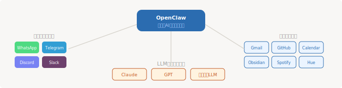

# 7. OpenClaw — 個人用AIアシスタント



ここまでの章では、コーディングや業務タスクにフォーカスしてきました。この章では視点を変えて、**日常生活全体をAIでアシストする**ツールを紹介します。

筆者も使っていますが、正直まだ使いこなせていません。一緒に育てていきましょう。

## OpenClaw とは

[OpenClaw](https://openclaw.ai/) は、オープンソースの個人用AIアシスタントです。自分のPC上で動作し、複数のチャットアプリ・サービスと連携して、日常のあらゆるタスクを自動化できます。

**一言でいうと：** 「自分専用の Siri / Google Assistant を、好きなLLMで、好きなサービスと繋げて作れる」ツールです。

- GitHub: [github.com/openclaw/openclaw](https://github.com/openclaw/openclaw)
- ドキュメント: [docs.openclaw.ai](https://docs.openclaw.ai)
- コミュニティ: [Discord](https://discord.gg/clawd)
- ライセンス: MIT

## 他のツールとの違い

| | ChatGPT / Claude Desktop | OpenClaw |
|--|--------------------------|----------|
| **LLM** | 固定（各社のモデル） | 自由に選べる（Claude, GPT, ローカルLLM等） |
| **データ** | クラウドに送信 | ローカルに保存 |
| **連携** | プラグイン/MCP経由 | 50以上のサービスに直接連携 |
| **操作方法** | 専用アプリを開く | 普段のチャットアプリから |
| **カスタマイズ** | 限定的 | 完全に自由（オープンソース） |
| **コスト** | 月額サブスク | 無料（LLMのAPIコストのみ） |
| **記憶** | セッション単位 | 永続メモリ（Markdown ベース） |

## まず何から始めるか

### ステップ1: インストール

```bash
# インストール（Node.js 24推奨、22.14+でも可）
curl -fsSL https://openclaw.ai/install.sh | bash

# 初期セットアップ（約2分）
openclaw onboard --install-daemon
```

> **Windows の場合：** WSL2 が必須です。直接実行はできません。

### ステップ2: ゲートウェイの確認

```bash
# 状態を確認
openclaw gateway status

# Web UIを開く
openclaw dashboard
```

ダッシュボードが開けば準備完了です。

### ステップ3: チャンネルを接続する

まずは**1つだけ**チャンネルを繋ぎましょう。おすすめは普段使っているチャットアプリです。

| チャンネル | 始めやすさ |
|-----------|----------|
| **Telegram** | 最も簡単。Bot作成が数分で完了 |
| **Discord** | Bot 作成に慣れていれば簡単 |
| **Slack** | ワークスペースの管理権限が必要 |
| **WhatsApp** | やや設定が複雑 |

### ステップ4: テストメッセージを送る

接続したチャットアプリから、簡単な質問を投げてみましょう。

```
「今日は何曜日？」
「自己紹介して」
「明日の天気を調べて」
```

返答が来れば成功です。ここから育てていきます。

## メモリを育てる — OpenClaw を賢くする方法

OpenClaw の最大の強みは**永続メモリ**です。使い込むほど、あなたのことを理解するアシスタントに成長します。

### メモリの仕組み

OpenClaw のメモリはすべて **プレーン Markdown ファイル**。隠れた状態は存在せず、いつでも読み書きできます。

| ファイル | 役割 | 読み込みタイミング |
|---------|------|-----------------|
| `MEMORY.md` | 長期記憶（好み・決定事項・ルール） | 毎セッション開始時 |
| `memory/YYYY-MM-DD.md` | 日次ノート（その日の出来事） | 当日と前日分を自動ロード |
| `DREAMS.md` | バックグラウンド統合（短期→長期への昇格） | オプション |

### 効果的な育て方

**最初の1週間でやること：**

```
「私のことを覚えて：名前は○○、エンジニアで、TypeScriptが好き」
「毎朝のブリーフィングでは天気と今日のカレンダーを含めて」
「メールの返信トーンはカジュアルだけど丁寧にして」
「コードレビューのときはセキュリティを重視して」
```

**ポイント：**
- **明示的に「覚えて」と言う** — 暗黙の学習はしない。言わないと覚えない
- **好みを具体的に伝える** — 「丁寧に」より「ですます調で、絵文字は使わない」の方が効く
- **間違いを訂正する** — 「違う、○○じゃなくて△△」と言えば記憶を更新する
- **定期的に MEMORY.md を確認する** — 不要な記憶を削除、曖昧な記憶を修正

**2週目以降：**
- よく頼むタスクのパターンを覚えさせる
- 「毎週月曜に○○して」のような定期タスクを設定
- プロジェクトごとのコンテキストを記憶させる

### DREAMS.md（上級）

`DREAMS.md` を有効にすると、OpenClaw がバックグラウンドで日次ノートを分析し、重要な情報を長期記憶（MEMORY.md）に昇格させます。手動で記憶を整理する手間が減ります。

## おすすめスキル

OpenClaw には50以上のスキルがあります。`~/.openclaw/workspace/skills/` に配置されます。

### まず入れるべきスキル

| カテゴリ | スキル | できること |
|---------|--------|----------|
| **メール** | Gmail | メールの読み取り・返信・分類 |
| **カレンダー** | Google Calendar | 予定の確認・作成・リマインド |
| **メモ** | Obsidian | ノートの検索・作成・更新 |
| **タスク** | Todoist | タスクの追加・完了・一覧 |

### 慣れてきたら

| カテゴリ | スキル | できること |
|---------|--------|----------|
| **コード** | GitHub | Issue確認・PR作成・リポジトリ検索 |
| **チャット** | Slack | チャンネル閲覧・メッセージ送信 |
| **スマートホーム** | Philips Hue | 照明の操作・シーン設定 |
| **音楽** | Spotify | 再生・プレイリスト操作 |
| **ブラウザ** | Web Browsing | Webサイト閲覧・データ抽出・フォーム入力 |

### ClawHub — コミュニティスキル

[ClawHub](https://github.com/openclaw/openclaw) でコミュニティが作ったスキルを探せます。スキルの共有・リミックスも可能です。

**スキルの自作もできます：**

```
「Notionの日報を自動作成するスキルを作って」
```

会話中に頼むだけで、OpenClaw が `SKILL.md` を生成してくれます。ホットリロード対応なので、即座に使えます。

## おすすめのLLMバックエンド

`~/.openclaw/openclaw.json` で設定します。`<provider>/<model-id>` 形式。

### 用途別おすすめ

| 用途 | 推奨モデル | 理由 |
|------|----------|------|
| **メインバックエンド** | Claude Sonnet | 指示追従性が高く、ツール呼び出しが安定 |
| **複雑な判断** | Claude Opus | 高度な推論が必要なタスク向け |
| **コスト重視** | GPT-4o-mini | 安くて十分な品質。日常タスクに |
| **プライバシー重視** | ローカルLLM（Qwen 3.6等） | データが外に出ない |
| **高速応答** | Groq（Llama等） | 超低レイテンシ。簡単な質問向け |

### 実践的な使い分け

メインは **Claude Sonnet** にしておき、コストが気になる場合は軽いタスクだけ **GPT-4o-mini** に回すのがバランス良いです。

機密性の高い情報を扱う場合は**ローカルLLM一択**です。LM Studio でローカルAPIサーバーを立てて、OpenClaw のバックエンドに設定できます。

## 活用事例集

### レベル1: まず試してみる

```
# 朝のブリーフィング
「今日の予定と天気を教えて」

# メール要約
「未読メールを要約して、返信が必要なものを教えて」

# リマインド
「14時の会議の15分前にリマインドして」
```

### レベル2: 日常タスクの自動化

```
# メール仕分け
「重要でないメールにはアーカイブラベルを付けて」

# 議事録
「今日の会議の内容をObsidianに議事録として保存して」

# 日報
「今日やったことをまとめて日報を作って」
```

### レベル3: 複数サービスの連携

```
# メール → タスク
「クライアントからのメールをTodoistにタスクとして登録して」

# カレンダー → Slack
「明日の会議の参加者にSlackでリマインドして」

# GitHub → メール
「PRがマージされたら関係者にメールで通知して」
```

### レベル4: パーソナルOS として使い倒す

ここまで来ると、OpenClaw は単なるツールではなく**パーソナルOS**になります。

```
# 朝の自動ルーティン
「毎朝8時に以下を実行して：
  1. 天気予報を取得
  2. 今日のカレンダーを確認
  3. 未読メールを要約
  4. Todoist の今日のタスクを一覧
  5. 以上を Telegram にまとめて送信」

# 週次レビュー
「毎週金曜17時に今週のメモとタスクを振り返って、
  来週やるべきことを提案して」
```

## 上級テクニック

### SOUL.md — エージェントの性格を設定

`SOUL.md` で OpenClaw の振る舞いを根本からカスタマイズできます。

```markdown
# SOUL.md の例

あなたは私の個人秘書です。
- 丁寧だけど簡潔に話す
- 重要度が低いことは勝手に判断して処理していい
- 判断に迷ったらTelegramで確認を取る
- 毎日の終わりにその日の要約を送る
```

### マルチエージェント

チャンネルやアカウントごとに独立したエージェントにルーティングできます。

```
仕事用Slack → ビジネスモードのエージェント
個人Telegram → カジュアルモードのエージェント
```

### Cronジョブ — プロアクティブな動作

OpenClaw にバックグラウンドで定期タスクを実行させられます。

- 毎朝のブリーフィング送信
- 定期的なメールチェック
- 週次レポートの自動生成

### 自作スキルの作り方

`~/.openclaw/workspace/skills/my-skill/SKILL.md` を作成するだけ。

```markdown
---
name: daily-standup
description: 日次スタンドアップレポートを生成
---

# Daily Standup Generator

1. 昨日の日次ノート（memory/）を読む
2. GitHub の昨日のコミットを取得
3. 今日のカレンダーを確認
4. 以下のフォーマットでレポートを生成:
   - 昨日やったこと
   - 今日やること
   - ブロッカー
```

## セキュリティに関する注意

> **OpenClaw は強力なツールですが、セキュリティには十分注意してください。**

### スキル・プラグインのインストール

**ClawHub からサードパーティ製のスキルをインストールする際は慎重に。**

- **出所不明のスキルは入れない** — 悪意あるスキルがシステムコマンドを実行する可能性がある
- **権限を確認する** — スキルがどのサービス・ファイルにアクセスするか確認してからインストール
- **公式・信頼できる開発者のスキルを優先** — スター数やレビューを確認する
- **機密情報を扱う連携は特に慎重に** — Gmail、GitHub など認証情報を渡すサービスは信頼できるスキルのみ

### メインセッションの注意

OpenClaw のメインセッションは**ホスト上でフルアクセス権限**で実行されます。非メインセッションは Docker サンドボックス内で実行されますが、メインセッションは制限なしです。

信頼できる環境でのみ使用し、サーバーとして常時稼働させる場合は適切なセキュリティ設定を行ってください。

## つよつよにするためのロードマップ

1週目から段階的に進めていくのがおすすめです。

| 期間 | やること | ゴール |
|------|---------|--------|
| **1週目** | インストール、チャンネル接続、基本的な質問 | 動くことを確認 |
| **2週目** | メモリに好み・ルールを教える、Gmail接続 | 朝のブリーフィングが届く |
| **3週目** | Obsidian/Todoist 連携、定期タスク設定 | 日常タスクが自動化される |
| **1ヶ月** | SOUL.md 調整、スキル追加 | 自分好みのアシスタントに |
| **2ヶ月** | 自作スキル、マルチエージェント | パーソナルOS として稼働 |
| **3ヶ月〜** | DREAMS.md、高度な連携ワークフロー | 育ったアシスタントが戦力に |

**焦らないこと。** 一度に全部やろうとすると設定地獄になります。まずは1つのチャンネルで1つのタスク（朝のブリーフィング等）を自動化するところから始めましょう。

---

[← 目次に戻る](./) | [前: Skills の活用](06-skills)
